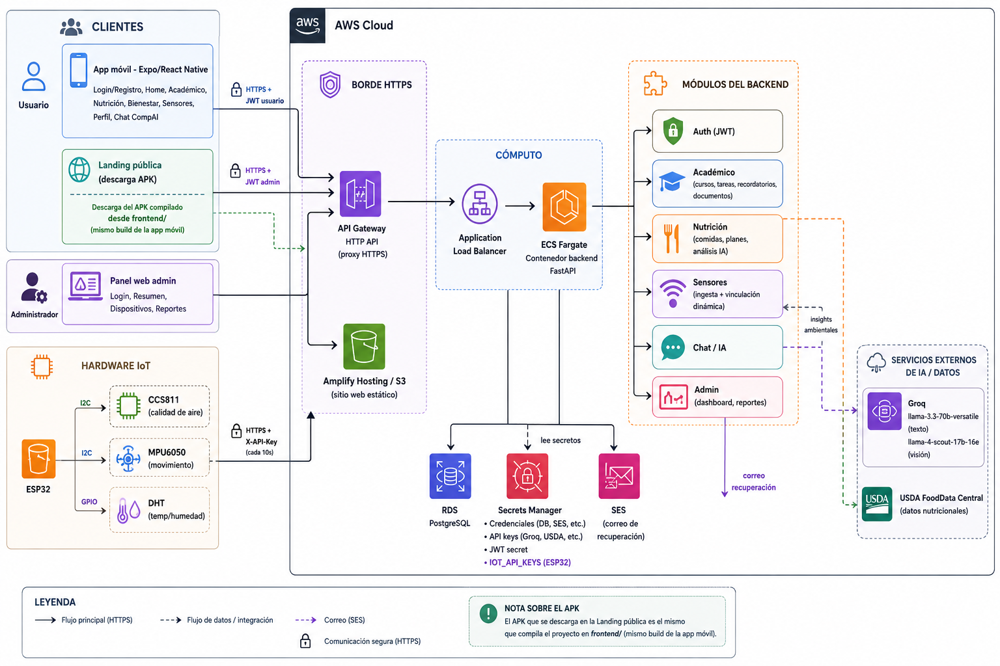

# 1. Nombre del proyecto

**CompAI**

## 2. Integrantes del grupo

- Francis Andres Huerta Roque — 202310535

## 3. Problema identificado

Los estudiantes manejan su vida académica, su alimentación y su entorno físico con herramientas separadas, cuando las tienen. Muchas veces todo esto se lleva de memoria o en papel: los cursos y tareas en una agenda, las calorías (si acaso) anotadas a mano, y nada que les diga si el aire de su cuarto o su temperatura están afectando su concentración.

Esto afecta sobre todo a estudiantes que quieren organizarse mejor pero no tienen tiempo ni ganas de usar tres o cuatro apps distintas para lograrlo. Es un problema real porque la desorganización y los malos hábitos de alimentación bajan el rendimiento, y las condiciones ambientales malas (poca ventilación, temperatura incómoda) afectan la concentración sin que uno lo note, porque no hay forma de medirlas.

Si esto no se resuelve, el estudiante sigue perdiendo información entre apps que no se hablan entre sí, cometiendo errores al anotar manualmente y sin recibir ninguna recomendación basada en su propia información.

## 4. Propuesta de solución

CompAI es un asistente que junta en un solo lugar lo académico, la nutrición/bienestar y el monitoreo del ambiente, apoyado en un equipo IoT físico y en Inteligencia Artificial.

Cómo funciona: desde la app móvil el usuario organiza cursos, tareas y recordatorios, registra sus comidas por texto o simplemente con una foto (el análisis nutricional lo hace la IA), sigue rutinas de bienestar, ve en vivo las lecturas de un sensor ESP32 vinculado a su cuenta, y puede conversar con el asistente CompAI, que ya conoce su información. El equipo IoT mide calidad de aire, movimiento y temperatura/humedad y manda esos datos al backend solo. Aparte hay un panel web para que el administrador supervise los dispositivos y los reportes de la app. Todo esto ya está corriendo en AWS, no es solo una maqueta.

El valor para el usuario es simple: no tiene que anotar calorías a mano (con una foto basta), no tiene que revisar el ambiente de su cuarto manualmente, y su asistente de IA le responde con contexto real en vez de ser un chatbot genérico. La diferencia con una solución tradicional es que ahí las apps sueltas no se comunican entre sí ni aprenden nada del usuario; en CompAI todo vive en una sola cuenta, y el hardware se puede pasar de un usuario a otro sin reconfigurar nada.

## 5. Perfiles del sistema

### Usuario

- Registrarse e iniciar sesión (con recuperación de contraseña por correo).
- Organizar cursos, tareas, recordatorios y documentos.
- Registrar comidas por texto o foto, con análisis nutricional automático.
- Seguir rutinas de bienestar.
- Ver en vivo las lecturas del sensor IoT vinculado a su cuenta.
- Conversar con el asistente CompAI.

### Administrador

- Iniciar sesión en un panel separado del de los usuarios.
- Ver el detalle de un usuario registrado.
- Supervisar el estado de los dispositivos IoT vinculados (en línea o no, última lectura, de quién es).
- Revisar y cambiar el estado de los reportes de la app.
- Ver métricas generales y el crecimiento de usuarios.

## 6. Aplicación web o móvil

**Tipo:** web y móvil — panel administrativo más app para usuarios.

- **App móvil** (Android, Expo/React Native): la usa el perfil Usuario.
- **Panel web administrativo**: lo usa el perfil Administrador.
- **Landing pública**: presenta el proyecto y permite descargar el APK.

Pantallas de la app: inicio de sesión y registro, inicio, académico, nutrición, bienestar, sensores, perfil, y el chat con CompAI (accesible desde bienestar y perfil).

Pantallas del panel web: inicio de sesión de administrador, resumen (métricas y gráfico de registros), dispositivos (estado de los equipos IoT) y reportes (gestión de estado).

## 7. Hardware a utilizar

| Sensor | Función | Datos que captura | Conexión | Frecuencia |
| --- | --- | --- | --- | --- |
| **ESP32** | Recolecta las lecturas y las manda al backend | — | WiFi → HTTPS con API Key propia | Cada 10 s |
| **CCS811** | Calidad de aire | eCO2 y TVOC | I2C al ESP32 | Cada 10 s |
| **MPU6050** | Movimiento | Acelerómetro y giroscopio | I2C al ESP32 | Cada 10 s |
| **DHT** | Ambiente | Temperatura y humedad | GPIO al ESP32 | Cada 10 s |

El equipo se configura la primera vez por WiFi con un portal propio ("CompAI-Setup"); después se reconecta solo. No queda atado a una cuenta fija: se vincula al usuario que abra la pantalla de Sensores en ese momento.

## 8. Uso de Inteligencia Artificial

Usamos modelos de Groq: `llama-3.3-70b-versatile` para texto (chat, análisis de comidas descritas por texto, insights de los sensores) y `llama-4-scout-17b-16e-instruct`, que tiene visión, para leer fotos de comida.

Procesa: los mensajes del chat junto con el contexto real del usuario, fotos y descripciones de comidas, y las lecturas de los sensores.

Con eso genera: respuestas del asistente CompAI personalizadas, la estimación de calorías y macronutrientes a partir de una foto o texto, y observaciones sobre las lecturas ambientales.

El beneficio es que el usuario no necesita saber de nutrición ni anotar nada a mano: con una foto o una frase ya tiene el análisis, y las recomendaciones que recibe están basadas en su propia información. Por ahora esto es solo para el perfil Usuario; el administrador no usa la IA directamente todavía.

## 9. Arquitectura inicial de la solución

El usuario solo habla con la app móvil (y la landing); el administrador solo con el panel web, cada uno con su propio JWT. El hardware manda sus datos directo a AWS sin pasar por ninguno de los dos, autenticado con su propia API Key. Todo entra por HTTPS: API Gateway → Load Balancer → ECS Fargate, donde vive el backend dividido en sus módulos (Auth, Académico, Nutrición, Sensores, Chat/IA, Admin). Solo el backend toca la base de datos, los secretos, el correo y los servicios externos de IA. La landing se sirve aparte, en Amplify/S3, y el APK que descarga ahí es el mismo que se compila en `frontend/`.

## 10. Tecnologías propuestas

- **Frontend:** Expo / React Native (TypeScript), React Navigation.
- **Backend:** Python + FastAPI, SQLAlchemy 2, Alembic, Pydantic v2, JWT.
- **Base de datos:** PostgreSQL (RDS en producción; SQLite en desarrollo).
- **Hardware:** ESP32 (PlatformIO/Arduino), CCS811, MPU6050, DHT, WiFiManager.
- **IA:** Groq (`llama-3.3-70b-versatile` y `llama-4-scout-17b-16e-instruct`), USDA FoodData Central.
- **Cloud:** AWS (ECS Fargate, RDS, Secrets Manager, API Gateway, Amplify, S3, SES, ECR), Docker.

## 11. Alcance inicial del proyecto

### Obligatorias (ya hechas y funcionando)

- Registro, login y recuperación de contraseña.
- Cursos, tareas, recordatorios (con notificaciones) y documentos.
- Registro de comidas con análisis nutricional por texto o foto.
- Rutinas de bienestar.
- Sensores IoT con vinculación dinámica al usuario.
- Chat con CompAI.
- Panel de administración con dashboard, dispositivos y reportes.
- Todo desplegado en AWS y probado con hardware real.

### Opcionales (si el tiempo alcanza)

- Editar o suspender usuarios desde el panel (hoy solo se puede ver su detalle).
- Configurar parámetros del sistema desde el panel.
- Que el usuario pueda crear reportes desde la app (hoy solo el admin los gestiona).
- Botón físico de reset de WiFi en el equipo.

## 12. Viabilidad del proyecto

El hardware ya está armado y probado enviando datos reales. El acceso a IA ya está integrado y en uso (Groq y USDA). El equipo ya demostró los conocimientos necesarios construyendo y desplegando todo esto: backend, app compilada a APK, firmware y una infraestructura completa en AWS. Lo obligatorio ya está listo; lo que queda es tiempo para las funcionalidades opcionales, que se pueden ir agregando sin afectar lo que ya funciona.

Riesgos principales: solo hay un equipo IoT armado, así que no se ha probado con varios dispositivos a la vez. La cuenta de AWS es nueva y tiene algunas restricciones temporales, que ya se resolvieron con una alternativa (API Gateway en vez de CloudFront). La cola gratuita de EAS a veces se congestiona, para lo que ya se probó un build local como respaldo. Y depende de un proveedor externo de IA (Groq), así que un cambio en su API o su precio afectaría el chat y el análisis nutricional.

## 13. Impacto esperado

- **Educativo:** ordena la vida académica del estudiante en un solo lugar.
- **Salud:** mejora los hábitos de alimentación sin que el usuario sepa de nutrición.
- **Ambiental:** hace visible la calidad del aire y el ambiente donde estudia o descansa.
- **Productividad:** reemplaza varias apps sueltas por una sola cuenta y una sola conversación.
- **Automatización:** el hardware se vincula solo, el análisis nutricional es automático, y las alertas del panel también se generan solas.
